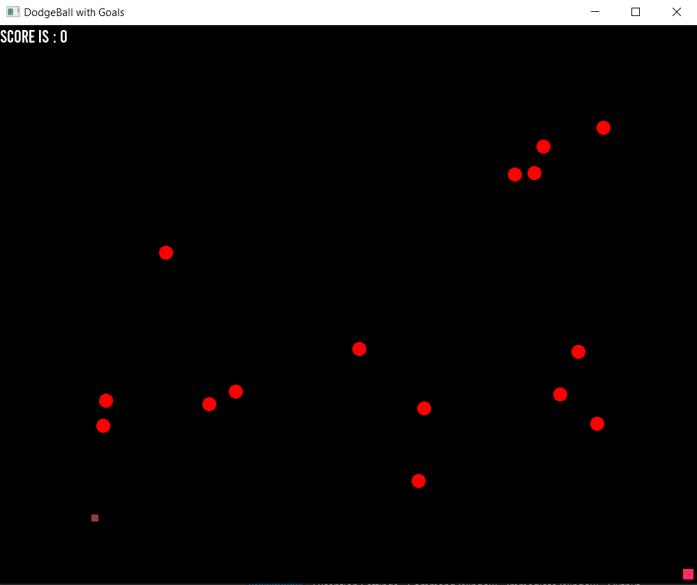

# dodgeball-game
SFML based game. single player dodgeball with goals

The rule of the game is simple. Collect as many goals as possible to increase score, while avoiding red balls at all costs!

To play the game, simply download this repo and run the code.

